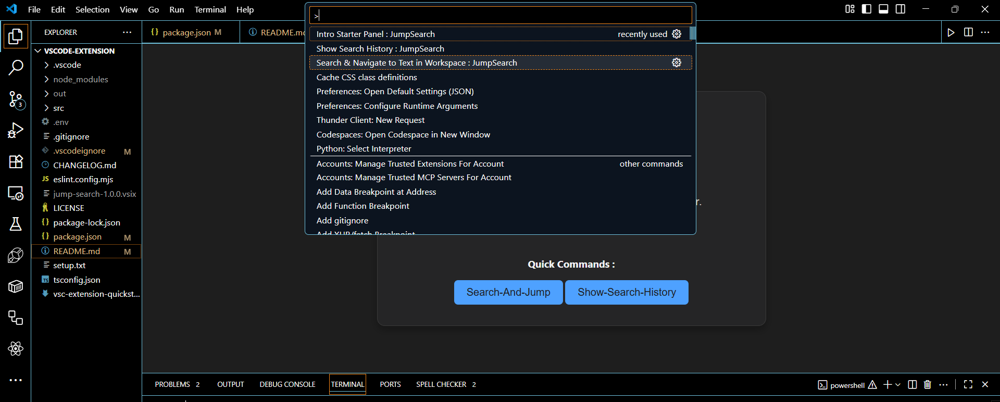

# JumpSearch

🚀 A simple yet powerful VS Code extension that lets you **search, View, and jump** to any text in your workspace — with a built-in **search history panel**.



---

## ✨ Features

- 🔍 **Search Across Workspace**: Search for any text or RegExp pattern in your project files.
- 🗂️ **Folder & File Type Filtering**: Choose specific folders and file types (`src/`, `.java`, etc.).
- ⚡ **Quick Navigation**: Jump directly to a match with one click.
- 📝 **Search History**: View and re-run your last 30 searches from a Webview panel.

---

## 📦 Commands

| Command ID                              | Title                                  | Description                                 |
| --------------------------------------- | -------------------------------------- | ------------------------------------------- |
| `jumpSearchExtension.helloWorld`        | Hello World Panel                      | Opens a sample webview panel (demo).        |
| `jumpSearchExtension.searchAndJump`     | Search & Navigate to Text in Workspace | Search workspace text and jump to matches.  |
| `jumpSearchExtension.showSearchHistory` | Show Search History                    | View and re-run recent searches in a panel. |

---

## ⚙️ Installation

Search for `JumpSearch` Extension in the **VS Code Marketplace** and click **Install**.

OR

### Install directly


OR

### Install manually:
   ```bash
   code --install-extension jump-search-1.0.0.vsix
   ```
